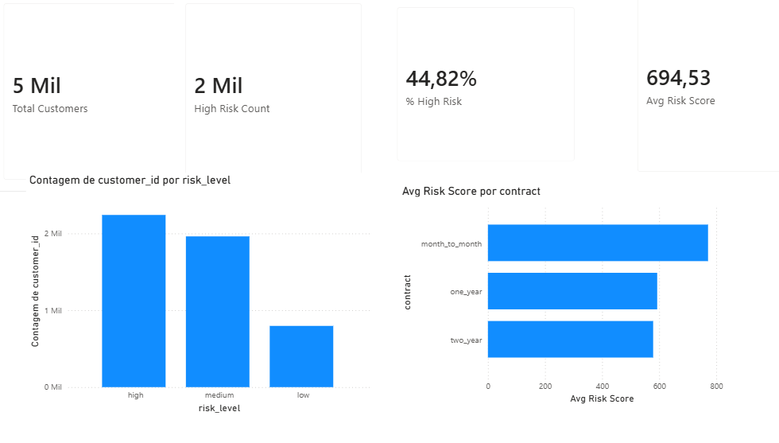

# 📊 Customer Health Risk Dashboard (Churn)

End-to-end analytics project focused on churn monitoring using **BI, Data Analytics and Machine Learning**.

The solution generates a **daily churn risk score per customer**, explains the main drivers behind the risk, and delivers insights through an **executive-ready Power BI dashboard**.

---

## 🎯 Business Objective
Monitor customer health and anticipate churn by:
- Identifying high-risk customers
- Explaining *why* they are at risk
- Supporting proactive retention actions

---

## 🧱 Architecture
- **Python**: ETL, feature engineering, ML model
- **Machine Learning**: Logistic Regression (explainable)
- **BI**: Power BI dashboard
- **Data Mart**: CSV ready for BI consumption
- **Cloud-ready**: Designed to run on AWS (S3 + Athena)

---

## 🔍 Machine Learning
- Supervised churn model (Logistic Regression)
- Output: churn probability (0–1)
- Risk levels:
  - Low (< 0.50)
  - Medium (0.50 – 0.75)
  - High (> 0.75)
- Explainability via model coefficients (top risk drivers)

---

## 📈 Dashboard (Power BI)

### Executive View


**KPIs**
- Total customers
- High-risk customers
- % High risk
- Average risk score

---

## 🧑‍💼 UX & Decision Support
The dashboard was designed for:
- **Executives**: high-level risk overview
- **Analysts**: segmentation and drilldown
- **Operations / Retention teams**: actionable customer lists with risk drivers

---

## 🚀 How to run locally
```bash
python -m src.etl.make_dataset
python -m src.model.train
python -m src.model.predict
python -m src.model.explain
python -m src.marts.build_mart
